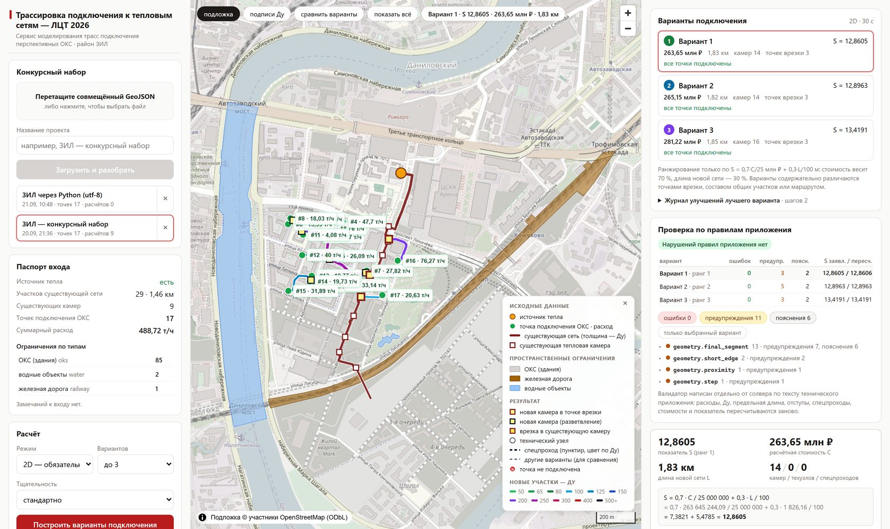

# Сервис моделирования трасс подключения к тепловым сетям

**Кейс ЛЦТ 2026 · Департамент информационных технологий города Москвы · команда Heat**

Сервис получает один GeoJSON с существующей тепловой сетью, камерами,
перспективными ОКС и пространственными ограничениями и за один запуск строит
варианты подключения всех ОКС: точки врезки, общие участки, расходы, условные
диаметры, спецпроходы, стоимость и итоговый показатель — строго по техническому
приложению кейса. Результат — GeoJSON по §7 приложения; каждое число в нём
пересчитывается независимым валидатором.



Конкурсный набор (ЗИЛ, 17 точек, 488,72 т/ч): **17 из 17 точек подключены,
S = 12,86 / 12,90 / 13,42, около 30 секунд на три варианта.** Нарушений правил
приложения нет ни в одном варианте.

---

## Как запустить

Репозиторий уже содержит конкурсный датасет, поэтому после клонирования сервис
можно поднять и сразу считать.

### Вариант 1. docker-compose — стенд по ТЗ §3.2

Поднимает три сервиса: Java-приложение (Spring Boot 2.6.3), расчётный сервис
на Python и PostgreSQL.

```bash
docker-compose up --build
```

* Приложение и интерфейс — <http://localhost:8080>
* Swagger — <http://localhost:8080/swagger-ui.html>
* Расчётный сервис напрямую (для отладки) — <http://localhost:8010/docs>

### Вариант 2. Без Docker

Нужны Python 3.11 и Node.js 20+.

**Расчётный сервис** (порт 8010):

```bash
python3.11 -m venv backend/.venv
backend/.venv/bin/pip install -r backend/requirements.txt
backend/.venv/bin/python -m uvicorn app.main:app --app-dir backend --port 8010
```

**Интерфейс** (порт 5173, проксирует `/api` на 8010) — во втором терминале:

```bash
npm install --prefix frontend && npm run dev --prefix frontend
```

Открыть <http://localhost:5173>.

> В Windows пути к интерпретатору другие: `py -3.11 -m venv backend/.venv`,
> затем `backend\.venv\Scripts\python.exe` вместо `backend/.venv/bin/python`.

**Java-приложение отдельно** (необязательно; нужны JDK 11+ и Maven). Работает на
H2 вместо PostgreSQL, расчётный сервис на 8010 должен быть уже запущен:

```bash
mvn -f service/pom.xml -DskipTests package
java -jar service/target/heat-network-service-0.1.0.jar \
  "--spring.datasource.url=jdbc:h2:file:./service/target/run/heat;MODE=PostgreSQL" \
  --spring.datasource.username=sa --spring.datasource.password= \
  --heat.data-dir=./service/target/run/projects \
  --spring.web.resources.static-locations=file:./frontend/dist/
```

### Что сделать в интерфейсе

1. Перетащить GeoJSON в поле загрузки — подойдёт
   `ресурсы/распаковано/ТЗ/Датасет скорректированный.geojson` из репозитория.
   Появится паспорт входа: сколько участков, камер, точек подключения,
   ограничений и что сервис не смог разобрать.
2. Нажать **«Построить варианты подключения»** — около 30 секунд на три варианта.
3. Посмотреть результат: карта с новой сетью, расходы и Ду на участках, таблицы
   участков и камер, проверка предельной длины, спецпроходы, добавочный расход
   по существующей сети и **протокол независимого валидатора** — клик по находке
   подсвечивает объект на карте.
4. **«Скачать результат»** — совмещённый GeoJSON со всеми вариантами по §7
   приложения.

### Расчёт из командной строки

Без интерфейса, с картинкой лучшего варианта:

```bash
backend/.venv/bin/python backend/case_cli.py \
  --input "ресурсы/распаковано/ТЗ/Датасет скорректированный.geojson" \
  --out result.geojson --png result.png
```

Режим с учётом глубины и тщательный поиск (в 2–3 раза дольше):

```bash
backend/.venv/bin/python backend/case_cli.py \
  --input "ресурсы/распаковано/ТЗ/Датасет скорректированный.geojson" \
  --out result_depth.geojson --mode depth --effort thorough
```

---

## Как проверить, что результат правильный

Выход проверяет **независимый валидатор**: он написан отдельно по тексту
технического приложения и пересчитывает каждое число — длины, расходы, Ду,
предельную длину, отступы, углы, спецпроходы, стоимость и показатель S.

```bash
backend/.venv/bin/python backend/validate_cli.py \
  --input "ресурсы/распаковано/ТЗ/Датасет скорректированный.geojson" \
  --output result.geojson
```

Прогон по всем наборам сразу — конкурсному и восьми синтетическим (дороги,
трамвай, газ, кабели, парки, строковые id, район вчетверо на 68 точек,
заведомо недостижимая точка):

```bash
backend/.venv/bin/python backend/verify_all.py
```

| Набор | Подключено | S | Ошибок валидатора |
|---|---|---|---|
| конкурсный (ЗИЛ) | 17/17 | 12,86 | 0 |
| big (район ×4, 68 точек) | 68/68 | 50,31 | 0 |
| blocks, mixed, roads, strings, tram, utilities | 17/17 | 12,79…12,99 | 0 |
| unreachable (точка в кольце запрета) | 16/17 | 15,33 | 0 |

Тесты (352 Python + 5 Java):

```bash
backend/.venv/bin/python -m pytest backend/tests -c backend/pytest.ini --rootdir=backend -q
mvn -f service/pom.xml test
```

---

## Документация

| Файл | Что внутри |
|---|---|
| [`docs/07-case-model.md`](docs/07-case-model.md) | Правила приложения, переписанные под код, и трактовки неоднозначных мест |
| [`docs/08-case-algorithm.md`](docs/08-case-algorithm.md) | Алгоритм целиком, точки без маршрута, выходные данные, границы применения (ТЗ §5) |
| [`docs/02-architecture.md`](docs/02-architecture.md) | Архитектура; §0 — целевая по ТЗ (Java-приложение + Python-расчёт) |
| [`docs/09-interim-report.md`](docs/09-interim-report.md) | Что реализовано, риски, план (ТЗ §7.1) |
| [`docs/05-demo-script.md`](docs/05-demo-script.md) | Сценарий демонстрации по десяти пунктам ТЗ §4 |
| [`docs/presentation/`](docs/presentation) | Презентация решения |

Документы `01`–`04`, `06`, `90` и `05-demo-script-legacy.md` относятся к прежней
модели (см. последний раздел).

---

## Архитектура

```
 docker-compose:  app (Java 11, Spring Boot 2.6.3, PostgreSQL, Swagger)  ⇄  solver (Python, FastAPI)
                  публичный API, загрузка до 3 ГБ потоком, фронтенд         расчёт, валидатор
```

ТЗ §3.2 требует Java, Spring Boot, PostgreSQL и docker-compose; расчётное ядро
удобнее держать на Python (Shapely, rasterio, scikit-image). Приложение
`service/` закрывает стек, загрузку и хранение, а расчёт вызывает по путям на
общем томе (`POST /api/v1/solve-file`). Публичный API у обоих одинаковый,
поэтому интерфейс работает и с Python-сервисом напрямую.

**Стек:** Python 3.11 · FastAPI · Shapely 2 · pyproj · scikit-image · rasterio ·
React 19 · TypeScript · Vite · MapLibre GL JS · Java 11 · Spring Boot 2.6.3 ·
PostgreSQL.

### API

Одинаков у Python-сервиса (8010) и Java-приложения (8080).

| Метод | Путь | Что делает |
|---|---|---|
| `POST` | `/api/v1/projects` | загрузить GeoJSON (multipart `file`, `name`) → паспорт и протокол разбора |
| `GET` | `/api/v1/projects`, `/projects/{id}`, `/projects/{id}/input.geojson` | проекты, паспорт, входной файл |
| `POST` | `/api/v1/projects/{id}/solve` | `{mode: 2d\|depth, max_variants: 1..3, effort: standard\|thorough}` → задание |
| `GET` | `/api/v1/jobs/{id}`, `/jobs/{id}/summary`, `/jobs/{id}/output.geojson`, `/jobs/{id}/validation` | состояние, сводка, выход, протокол валидатора |
| `GET` | `/api/v1/rules` | таблицы технического приложения |

---

## Что реализовано

- [x] Разбор входа по §1 приложения с протоколом разбора, сохранение типов id
- [x] Поле стоимости в единицах показателя S, карта достижимости
- [x] Выход из полигона ОКС от ближайшей границы, запасные кандидаты
- [x] Дерево совместного подключения: одна волна Дейкстры на точку — к сети,
      существующим камерам (правило 10 м) и уже построенным веткам
- [x] Прямые участки, повороты ≤ 90° в вершинах и в камерах вдоль путей,
      без огрызков и ступенек
- [x] Расходы, Ду по таблице 1, предельная длина с поднятием со стороны врезки,
      проверка минимальности
- [x] Ограничения таблицы 2: запреты с отступом по Ду, спецпроходы одним прямым
      участком, угол ≥ 45°, техузлы, Kспец при наложениях
- [x] Стоимость и сводка по выгружаемой геометрии, выход по §7 приложения
- [x] До трёх вариантов из разных порядков точек, локальный поиск, ранжирование по S
- [x] Режим с учётом глубины: профиль над и под подземными линиями, уклон ≤ 0,10, Kгл
- [x] Независимый валидатор выхода и генератор синтетических наборов
- [x] HTTP-API, интерфейс, Java-приложение по ТЗ §3.2, Dockerfile и docker-compose
- [x] Справочно: добавочный расход по существующей сети до источника

Реконструкция существующей сети в расчётной модели не выполняется — это прямо
следует из технического приложения и разъяснения № 14; вместо неё сервис
показывает справочно, по каким существующим участкам пойдёт добавочный расход.

---

## Прежняя модель

До получения технического приложения сервис строился на СП 124.13330:
нормативные отступы, гидравлика, плата по ПП 787, реальный рельеф, экспорт
DXF/PDF. Эта часть осталась в `backend/app/` как расширение под
`/api/legacy/v1` и в документах `01`–`04`, `06`, `90`; в обязательную часть
кейса она не входит.
